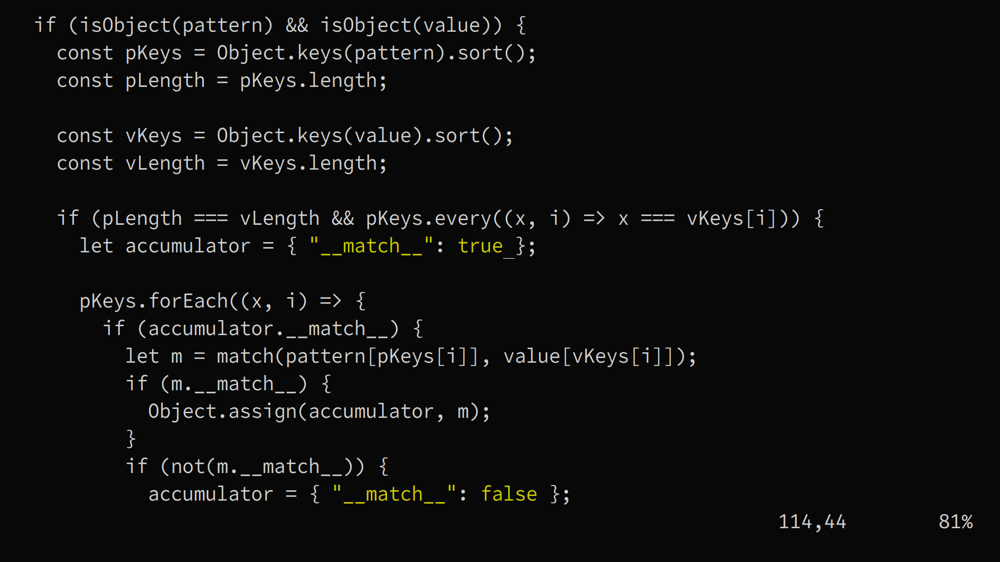
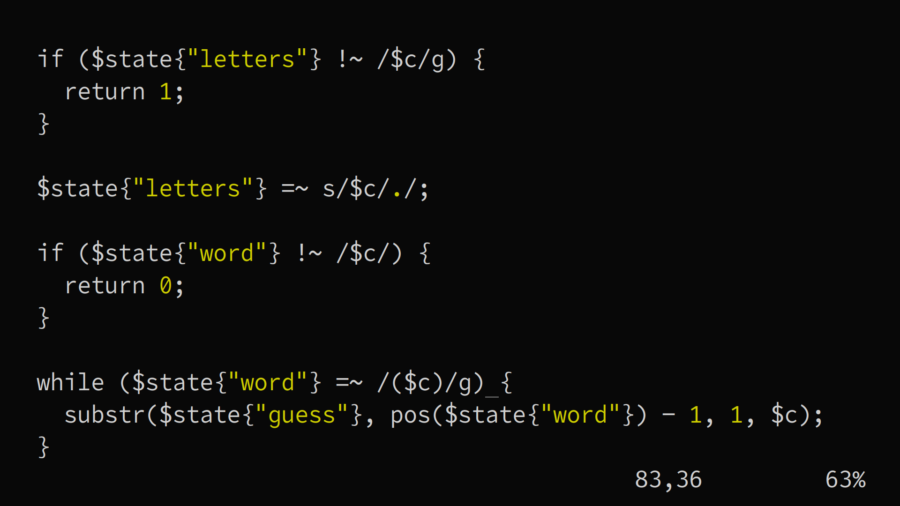

# Hera
Hera is a monospace font which is a customised version of Source Code Pro which
was originally created by Paul Hunt.

Hera consists mainly of glyphs from Adobe Source Code Pro mixed with glyphs from
popular monospace fonts like Fira Mono, Inconsolata, IBM Plex Mono, etc.

Hera emphasises readability and uniformity for sigils and symbols which makes
it suitable for use in coding environments.

## Screenshots



## Installation
1. Clone this repository.

```bash

git clone https://github.com/sayyadirfanali/Hera.git

```

2. Copy `Hera.otf` into `~/.fonts/`.

```bash

mkdir ~/.fonts/
cd Hera
cp Hera.otf ~/.fonts/.

```

3. Update cache.

```bash

fc-cache

```

## Feedback
Hera is a very simple font. It doesn't currently feature bold or italics. It
was designed for my own personal workflow.

However, if you do come to use it, feel free to provide valuable feedback and
request for features. I'd be happy to add new features if requested.

## License
SIL Open Font License, Version 1.1

## Credits
- Source Code Pro by Paul Hunt
- Fira Mono by Erik Spiekermann, Ralph du Carrois, Anja Meiners, Botio Nikoltchev and Patryk Adamczyk.
- Inconsolata by Raph Levien
- Plex Mono by Mike Abbink, Paul van der Lan and Pieter van Rosmalen
- Office Code Pro by Nathan Rutzky
- Anonymous Pro by Mark Simonson
